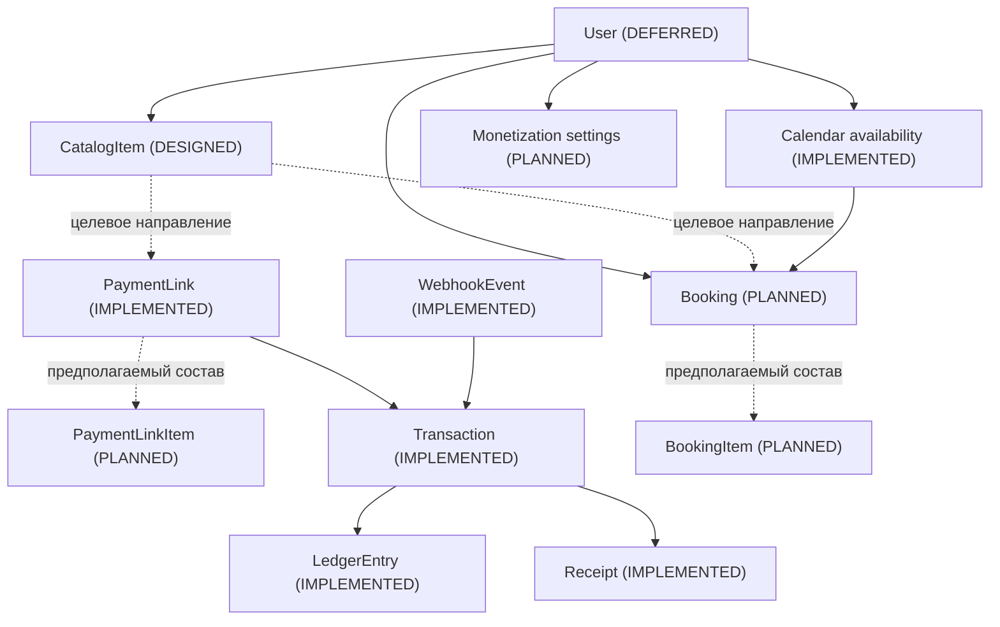

# Domain Model

## Назначение документа

Это компактная карта предметной области верхнего уровня. Она показывает
назначение сущностей, их текущий статус и концептуальные связи, но не
подменяет профильную архитектурную документацию.

Иерархия источников:

- DOMAIN_MODEL.md — общая карта сущностей;
- профильные архитектурные документы — подробные правила;
- [ROADMAP.md](../../ROADMAP.md) — порядок реализации;
- [PROJECT_STATE.md](../../PROJECT_STATE.md) — фактическое текущее состояние;
- Prisma schema и код — фактически реализованная техническая модель.

## Легенда статусов

| Статус | Значение |
| --- | --- |
| IMPLEMENTED | Реализовано в текущем коде. |
| DESIGNED | Архитектура согласована, но код ещё не реализован. |
| PLANNED | Направление зафиксировано, модель ещё требует проектирования. |
| DEFERRED | Сознательно отложено на последующий этап. |

## Entity Classification

| Категория | Сущности |
| --- | --- |
| Template | CatalogItem, WeeklyWorkingHours, CalendarDateOverride. |
| Document | PaymentLink, Receipt, будущие Booking, PaymentLinkItem и BookingItem. |
| Fact | Transaction, LedgerEntry. |
| System | Payment, WebhookEvent, OfficialCalendarDay, будущие User и назначение правил монетизации. |

## Ownership boundary

`User` — владелец одного бизнеса MVP. Прямой `ownerId` имеют CatalogItem,
WeeklyWorkingHours, CalendarDateOverride, Booking, PaymentLink и Transaction.
BookingItem наследует owner через Booking; Payment — через PaymentLink;
Receipt и LedgerEntry — через Transaction. OfficialCalendarDay и WebhookEvent
остаются system-scoped. `publicSlug` выбирает владельца только для публичного
`/book/[slug]` flow.

Классификация описывает доменную роль, а не Prisma-модели. Calendar остаётся
концептуальной предметной областью, а не отдельной сущностью или таблицей.

## Source of Truth

| Область | Источник истины |
| --- | --- |
| Catalog | CatalogItem; отдельная сущность Catalog отсутствует. |
| Payments | Transaction для факта оплаты; PaymentLink — предложение оплатить. |
| Finance | LedgerEntry для остатков и финансовых агрегаций. |
| Receipts | Receipt для состояния чека. |
| Calendar | WeeklyWorkingHours, OfficialCalendarDay и CalendarDateOverride; отдельная сущность Calendar отсутствует. |
| Booking | Будущий Booking после проектирования этапа Calendar and Booking. |

## Контекст продукта

Платформа помогает самозанятому создать каталог товаров и услуг, сформировать
платёжную ссылку, принять оплату, рассчитать налоговый резерв и комиссию
платформы, зафиксировать финансовые движения в Ledger и сформировать чек. В
будущем она будет поддерживать расписание и бронирования.

## Карта доменных областей

### Catalog — логическая область (IMPLEMENTED)

**Назначение:** типовые параметры товаров и услуг для будущих коммерческих
сценариев. Catalog — логическая совокупность CatalogItem, а не отдельная
сущность или таблица на текущем этапе MVP.

**Основная сущность:** CatalogItem.

**Подробности:** [CATALOG_ARCHITECTURE.md](./CATALOG_ARCHITECTURE.md).

### Sales and Payments — IMPLEMENTED / PLANNED

**Назначение:** предложение клиенту оплатить и обработка подтверждённого
платежа.

**Основные сущности:** PaymentLink, Payment, Transaction, WebhookEvent;
предполагаемая модель PaymentLinkItem.

**Подробности:** [PROJECT_STATE.md](../../PROJECT_STATE.md),
[ROADMAP.md](../../ROADMAP.md).

### Financial Accounting — IMPLEMENTED

**Назначение:** отражение финансовых движений и расчёт остатков.

**Основная сущность:** LedgerEntry. Ledger является источником истины для
финансовых остатков и агрегаций.

**Подробности:** [Ledger audit](../ledger/LEDGER_AUDIT_VERIFIED.md).

### Receipts — IMPLEMENTED / DEFERRED

**Назначение:** отражение состояния формирования чека по операции.

**Основная сущность:** Receipt. Базовая сущность и статусы реализованы; полная
интеграция с налоговым контуром отложена.

**Подробности:** [PROJECT_STATE.md](../../PROJECT_STATE.md),
[ROADMAP.md](../../ROADMAP.md).

### Calendar and Booking — IMPLEMENTED / PLANNED

**Назначение:** управление доступностью времени и будущими конкретными
визитами клиентов.

**Реализовано:** WeeklyWorkingHours, OfficialCalendarDay и
CalendarDateOverride определяют рабочий интервал конкретной даты с
приоритетом ручного правила над государственным календарём и недельным
графиком.

**Отложено:** Booking и предполагаемая модель BookingItem.

**Подробности:** [ROADMAP.md](../../ROADMAP.md),
[CATALOG_ARCHITECTURE.md](./CATALOG_ARCHITECTURE.md).

### Users and Ownership — DEFERRED

**Назначение:** владение данными и учётная запись самозанятого.

**Основная сущность:** User. Система пока однопользовательская; ownerId в
CatalogItem отсутствует.

**Подробности:** [ROADMAP.md](../../ROADMAP.md).

### Monetization — PLANNED

**Назначение:** правила дохода платформы от процентной комиссии и ежемесячного
тарифа.

**Основная сущность:** нейтральная доменная концепция назначения правил
монетизации; окончательные имена технических моделей не утверждены. Правила
назначаются глобально, сегменту, группе или отдельному клиенту. CatalogItem не
содержит правил монетизации.

**Подробности:** [ROADMAP.md](../../ROADMAP.md), [AGENTS.md](../../AGENTS.md).

### Compliance and Legal Constraints — PLANNED

**Назначение:** ограничения для будущих процессов, включая учёт рабочего
времени после уточнения нормативных требований.

**Основные сущности:** не одна доменная таблица, а набор ограничений; возможная
модель учёта времени ещё не утверждена.

**Подробности:** [LEGAL_AND_COMPLIANCE.md](./LEGAL_AND_COMPLIANCE.md).

## Основные сущности

### CatalogItem — IMPLEMENTED

Шаблон товара или услуги с типовыми параметрами. Не является фактом продажи.
При создании исторических документов используется snapshot. На текущем этапе
типы — SERVICE и PRODUCT; расширение списка типов требует отдельного решения.

### PaymentLink — IMPLEMENTED

Предложение клиенту оплатить. Текущая модель содержит одну сумму и не связана
с CatalogItem. Целевая архитектура должна поддерживать одну или несколько
позиций, но её техническая структура пока не утверждена.

### PaymentLinkItem — PLANNED

Предполагаемая строка платёжного документа для поддержки нескольких позиций.
Это продуктовое требование, но не утверждённая таблица: конкретная модель
должна быть согласована с Booking, Transaction, Receipt и жизненным циклом
продажи.

### Payment — IMPLEMENTED

Техническое представление платежа внешнего провайдера, связанное с
PaymentLink. Его состояние не заменяет Transaction как бизнес-факт принятой
оплаты.

### Transaction — IMPLEMENTED

Зафиксированный факт принятой оплаты и её финансовый результат. Не является
каталогом или бронированием.

### LedgerEntry — IMPLEMENTED

Атомарная запись финансового движения по Transaction. Ledger является
источником истины для финансовых остатков и агрегаций.

### Receipt — IMPLEMENTED

Состояние формирования чека по Transaction. Receipt не является финансовым
источником истины.

### Calendar — концептуальная область (IMPLEMENTED)

Правила доступности времени: рабочие часы, исключения, выходные и ручные
переопределения. Calendar не является отдельной таблицей: доступность
определяется WeeklyWorkingHours, OfficialCalendarDay и
CalendarDateOverride.

Calendar не рассчитывает слоты и не использует параметры CatalogItem.

### WeeklyWorkingHours — IMPLEMENTED

Базовое рабочее время одного дня недели. Одна запись допускается для каждого
dayOfWeek.

### OfficialCalendarDay — IMPLEMENTED

Государственное правило конкретной даты: HOLIDAY закрывает дату, а WORKING_DAY
отменяет только государственное закрытие и передаёт разрешение недельному
графику.

### CalendarDateOverride — IMPLEMENTED

Ручное правило конкретной даты. CLOSED закрывает дату, OPEN задаёт её
единственный рабочий интервал. Правило имеет наивысший приоритет.

### Booking — PLANNED

Конкретный визит клиента. Он должен использовать snapshot выбранных товаров
или услуг. Точная структура пока не определена.

### BookingItem — PLANNED

Предполагаемая строка состава бронирования. Несколько товаров и услуг в одном
визите допустимы, однако окончательная модель будет спроектирована на этапе
Calendar and Booking.

### User — DEFERRED

Будущий владелец каталога, расписания, бронирований и настроек монетизации.

### Назначение правил монетизации — PLANNED

Доменная концепция назначения правил дохода платформы. Подтверждены
процентная комиссия с клиентских платежей и ежемесячный тариф; техническое
название модели и детали реализации пока не утверждены.

### WebhookEvent — IMPLEMENTED

Входящее событие внешнего платёжного провайдера. Оно поддерживает приём,
идемпотентность и обработку событий, но не заменяет Transaction как
бизнес-факт оплаты. Реальная банковская интеграция остаётся будущим этапом.

## Концептуальные связи



Пунктир обозначает целевое направление или предполагаемую модель, а не
существующий внешний ключ.

## Жизненный цикл продажи

### Текущий реализованный поток

```text
PaymentLink
→ подтверждённая оплата через simulation или payment.succeeded webhook
→ Transaction
→ Receipt и четыре LedgerEntry в одной атомарной операции
```

PaymentLink сама по себе не создаёт Transaction, Receipt или LedgerEntry.

### Целевой поток

```text
CatalogItem
→ состав предложения
→ PaymentLink
→ Payment
→ Transaction
→ Ledger
→ Receipt
```

Состав предложения и его модель строк пока требуют проектирования.

### Сценарий с записью

```text
CatalogItem
→ Booking
→ PaymentLink или предоплата
→ Transaction
→ Ledger
→ Receipt
→ дальнейший статус выполнения визита
```

Это концептуальная схема. Порядок создания Booking и PaymentLink в сценарии
предоплаты не утверждён и требует отдельного проектирования.

## Границы ответственности

| Область | Ответственность |
| --- | --- |
| CatalogItem | Типовые параметры товара или услуги. |
| PaymentLink | Предложение оплатить. |
| Transaction | Факт оплаты. |
| Ledger | Финансовый учёт. |
| Receipt | Состояние чека. |
| Calendar | Доступность времени. |
| Booking | Конкретный визит. |
| Monetization | Правила дохода платформы. |
| User | Владение данными. |
| Legal and Compliance | Ограничения, а не одна доменная таблица. |

## Snapshot-принцип

Исторические документы и операции не должны зависеть от текущих значений
изменяемых шаблонов. Snapshot применяется там, где изменение исходной
сущности может исказить историю: название позиции, цена, единица измерения,
длительность, календарные буферы и другие коммерчески значимые параметры.

Точные названия полей для ещё не спроектированных моделей не фиксируются
этим документом.

## Текущее состояние и целевая модель

| Область | Сущность | Статус | Источник подробностей |
| --- | --- | --- | --- |
| Sales and Payments | PaymentLink | IMPLEMENTED | [PROJECT_STATE.md](../../PROJECT_STATE.md) |
| Sales and Payments | Payment / Transaction | IMPLEMENTED | Prisma schema и [PROJECT_STATE.md](../../PROJECT_STATE.md) |
| Sales and Payments | PaymentLinkItem | PLANNED | [CATALOG_ARCHITECTURE.md](./CATALOG_ARCHITECTURE.md) |
| Financial Accounting | LedgerEntry | IMPLEMENTED | [Ledger audit](../ledger/LEDGER_AUDIT_VERIFIED.md) |
| Receipts | Receipt | IMPLEMENTED | [PROJECT_STATE.md](../../PROJECT_STATE.md) |
| Integration | WebhookEvent | IMPLEMENTED | Prisma schema и [ROADMAP.md](../../ROADMAP.md) |
| Catalog | CatalogItem | IMPLEMENTED | [CATALOG_ARCHITECTURE.md](./CATALOG_ARCHITECTURE.md) |
| Calendar and Booking | WeeklyWorkingHours / OfficialCalendarDay / CalendarDateOverride | IMPLEMENTED | [PROJECT_STATE.md](../../PROJECT_STATE.md) |
| Calendar and Booking | Booking | PLANNED | [ROADMAP.md](../../ROADMAP.md) |
| Calendar and Booking | BookingItem | PLANNED | [CATALOG_ARCHITECTURE.md](./CATALOG_ARCHITECTURE.md) |
| Users and Ownership | User | DEFERRED | [ROADMAP.md](../../ROADMAP.md) |
| Monetization | Rules assignment | PLANNED | [ROADMAP.md](../../ROADMAP.md) |

## Открытые архитектурные вопросы

- Окончательная модель строк PaymentLink.
- Окончательная модель состава Booking.
- Порядок Booking и PaymentLink в сценарии предоплаты.
- Общая или отдельная модель строк для продажи и бронирования.
- Момент добавления User и ownerId.
- Техническая модель двух вариантов монетизации.
- Связь фактического рабочего времени с Booking и compliance.

## Ссылки на профильные документы

- [PROJECT_BRIEF.md](../../PROJECT_BRIEF.md)
- [PROJECT_STATE.md](../../PROJECT_STATE.md)
- [ROADMAP.md](../../ROADMAP.md)
- [CATALOG_ARCHITECTURE.md](./CATALOG_ARCHITECTURE.md)
- [LEGAL_AND_COMPLIANCE.md](./LEGAL_AND_COMPLIANCE.md)
- [Ledger audit](../ledger/LEDGER_AUDIT_VERIFIED.md)
